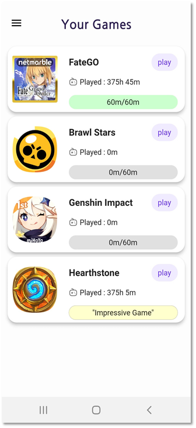
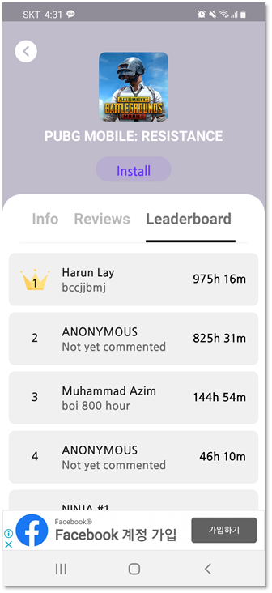
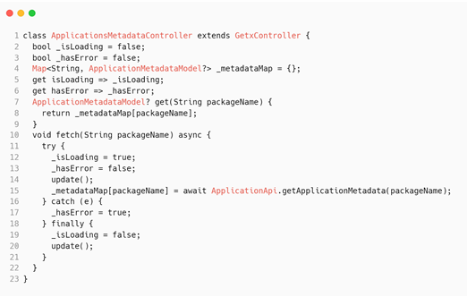
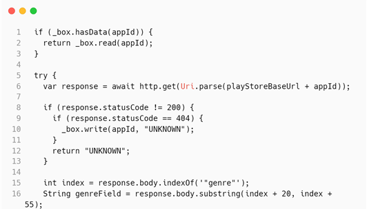
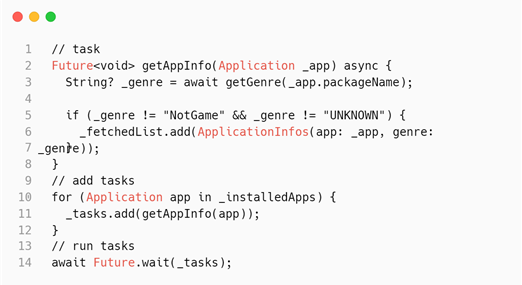
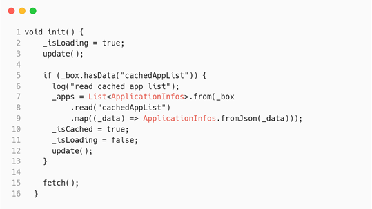

<!-- @format -->

# Real Gamer's Critics

## 소개 영상

[](https://www.youtube.com/watch?v=ZlgiZXRs8uU)

---

## 인앱 화면




---

## 코드 설명

● Observer Pattern을 사용하여 UI와 데이터 처리를 분리했다.


[Source Code](git.swmgit.org/swm-12/12_swm43/argonaut-app-usage/-/blob/master/lib/blocs/applications_metadata_controller.dart)

● 게임인 앱들을 안드로이드에서 제공해주는 사용 시간 API를 활용하여 사용 시간을 불러오고, 이를 활용하여 서비스를 제공함
● 앱의 게임 여부 확인을 위해 플레이스토어를 활용
● 결과를 캐싱하여 중복 확인을 방지함



[Source Code](git.swmgit.org/swm-12/12_swm43/argonaut-app-usage/-/blob/master/lib/functions/playstore/check_app.dart)

● 네트워크 통신은 대기 시간이 있어 순차적으로 처리 시 시간이 오래 소요됨
● 이를 병렬로 처리하여 속도를 비약적으로 상승시킴



[Source Code](git.swmgit.org/swm-12/12_swm43/argonaut-app-usage/-/blob/master/lib/blocs/applications_controller.dart)

● 앱이 100개 이상으로 넘어가면 사용 시간 로딩이 오래 걸려 기존에 캐싱된 리스트를 먼저 보여준 뒤 로딩을 진행함



[Source Code](git.swmgit.org/swm-12/12_swm43/argonaut-app-usage/-/blob/master/lib/blocs/applications_controller.dart)

---

## Getting Started

이앱을 빌드하기 전에 파이어베이스에서 google-services.json을

```
android/app/google-services.json
```

위치에 저장해야 합니다.
